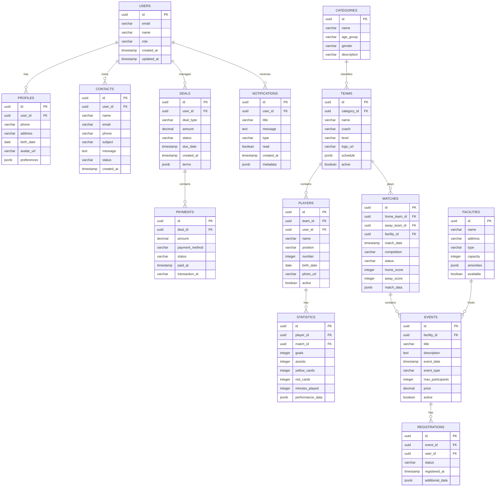

# PRD ESTRUTURADO - WEBSITE TUPÃ FC

## 1. Visão Geral

O Website Tupã FC representa a transformação digital completa de um clube esportivo tradicional em uma plataforma integrada e moderna, consolidando todas as operações, comunicações e experiências em um único ambiente digital. Esta solução nasce da necessidade urgente de superar a fragmentação atual onde informações estão dispersas em redes sociais desconexas, sites obsoletos e canais de comunicação desintegrados, criando uma experiência frustrante para torcedores que precisam consultar múltiplas fontes para obter dados simples como escalações, resultados ou compra de ingressos. A plataforma unifica desde a gestão institucional até a experiência do torcedor, oferecendo uma jornada coesa que conecta a rica história do clube com as demandas tecnológicas contemporâneas.

O problema central que esta solução endereça é a desconexão digital que afeta clubes tradicionais, onde torcedores enfrentam dificuldades para acessar informações confiáveis em tempo real, sócios não conseguem visualizar claramente seus benefícios, e a administração do clube opera com sistemas desconectados que impedem uma gestão eficiente. Exemplos concretos incluem a impossibilidade de verificar a escalação do time minutos antes da partida, a complexidade no processo de compra de ingressos que envolve múltiplos redirecionamentos, a falta de centralização de conteúdos multimídia como fotos e vídeos oficiais, e a carência de um canal único para comunicação institucional transparente com todos os stakeholders do clube.

A solução funciona através de uma arquitetura modular integrada que combina gestão administrativa robusta com experiências de usuário imersivas, permitindo que a equipe do clube atualize conteúdos em tempo real via painel administrativo intuitivo enquanto oferece aos torcedores funcionalidades avançadas como elenco 3D interativo, sistema de assinatura integrado e calendários dinâmicos. A plataforma conecta-se com APIs de redes sociais, serviços de streaming e sistemas de pagamento, criando um ecossistema digital coeso onde cada atualização no backend reflete instantaneamente na experiência do usuário final, desde a alteração tática da equipe até a disponibilização de ingressos para Sócios-Torcedores.

O público-alvo abrange desde torcedores casuais que buscam informações básicas até sócios premium que exigem benefícios exclusivos, incluindo também a imprensa esportiva que necessita de acesso rápido a releases oficiais e a administração do clube que requer ferramentas de gestão centralizada. Os diferenciais competitivos incluem a visualização tridimensional do elenco em tempo real, o sistema de assinatura com benefícios tangíveis integrado diretamente na plataforma, a gestão unificada de todos os conteúdos via painel administrativo customizado, e a experiência responsiva que se adapta perfeitamente desde dispositivos móveis até desktops, garantindo que cada interação refllete a identidade e valores do Tupã FC.

## 2. Funcionalidades

### 2.1 Perfis de Usuário

| Perfil | Registro | Permissões | Acessos |
|--------|-----------|-------------|----------|
| Administrador | Email corporativo + 2FA | Controle total do sistema | Configurações globais, gestão de usuários, relatórios analíticos, auditoria de logs, backup do sistema |
| Gerente de Conteúdo | SSO corporativo | Gestão de conteúdos e mídias | Dashboard editorial, calendário de publicações, upload de imagens/vídeos, moderação de comentários, métricas de engajamento |
| Sócio-Torcedor | Email + CPF validação | Acesso a benefícios exclusivos | Dashboard pessoal, histórico de ingressos, rede de descontos, renovação de assinatura, área VIP digital |
| Torcedor Básico | Email opcional | Acesso a conteúdos públicos | Notícias, calendário de jogos, galeria de fotos, compra de ingressos avulsos, formulário de contato |
| Comercial | Email corporativo | Gestão de parcerias e vendas | Dashboard comercial, gestão de patrocinadores, relatórios de vendas, controle de ingressos, métricas de conversão |
| Imprensa | Email verificado + credencial | Acesso a materiais oficiais | Seção de imprensa, downloads de releases, calendário de coletivas, banco de imagens oficial, contatos da assessoria |
| Desenvolvedor | Chave API + autenticação | Acesso a integrações | Documentação de APIs, logs de integração, testes de conectividade, monitoramento de serviços externos |

### 2.2 Módulos Principais

1. **Dashboard Central** - Visão unificada de KPIs críticos, gráficos em tempo real de acesso e engajamento, alertas de sistema, widgets arrastáveis personalizáveis por perfil, notificações push para eventos importantes e métricas de desempenho financeiro e operacional

2. **Gestão de Conteúdo** - Cadastro centralizado de todos os conteúdos textuais e multimídia, sistema de busca avançada com filtros por data, categoria e tags, importação/exportação em múltiplos formatos, versionamento de edições, agendamento automático de publicações e rastreamento de alterações

3. **Módulo de Elenco 3D** - Visualização tridimensional interativa do time, gerenciamento de escalações em tempo real, atualização dinâmica de formações táticas, integração com dados de desempenho, sistema de rotação de jogadores e exportação de visualizações para redes sociais

4. **Sistema de Assinaturas** - Gestão completa de planos de sócio-torcedor, processamento de pagamentos recorrentes, controle de benefícios por categoria, renovação automática com notificações, gestão de inadimplência e relatórios de fidelização

5. **Plataforma de Ingressos** - Venda integrada de tickets com seleção de setores via modal interativo, gestão de lotes e preços dinâmicos, validação QR Code, integração com sistema de assinaturas, controle de capacidade e relatórios de ocupação

6. **Calendário Dinâmico** - Exibição unificada de jogos, eventos e compromissos, integração com resultados em tempo real, upload manual de imagens e vídeos, sincronização com Google Calendar/Outlook, notificações personalizáveis e histórico completo

7. **Gestão de Parcerias** - Carrossel de patrocinadores com mínimo de 7 posições, controle de visibilidade por temporada, upload de materiais de marca, relatórios de exposure digital, gestão de contratos e renovação de parcerias

8. **Portal de Notícias** - Blog institucional com categorias temáticas, editor WYSIWYG avançado, agendamento de publicações, sistema de comentários moderado, integração com redes sociais e métricas de leitura por artigo

9. **Banco de Mídia** - Armazenamento centralizado de imagens, vídeos e documentos, organização por tags e categorias, busca por metadados, redimensionamento automático para diferentes dispositivos, controle de direitos autorais e histórico de downloads

10. **Sistema de Formulários** - Criação de formulários personalizados para trabalhe conosco, contato geral e recrutamento, armazenamento de respostas em banco de dados, notificações por email, exportação de dados e integração com CRM

11. **Gestão de Usuários** - Controle completo de perfis e permissões, registro com validação de email, recuperação de senha, moderação de acessos, histórico de atividades, bloqueio temporário e exclusão segura de contas

12. **Analytics e Relatórios** - Dashboard analítico com métricas de acesso, engajamento, conversões e receita, exportação em PDF/Excel, comparação temporal, identificação de tendências e relatórios automatizados por email

### 2.3 Páginas Principais

| Página | Módulo | Descrição | Elementos Principais |
|--------|--------|-----------|----------------------|
| Dashboard Admin | Principal | Visão geral de KPIs e gestão completa | Cards de métricas, gráficos de acesso, calendário de eventos, feed de atividades, alertas do sistema, quick actions |
| Homepage | Conteúdo | Página inicial com conteúdo dinâmico | Carrossel de destaques, últimas notícias, próximo jogo, elenco em destaque, redes sociais, hino player |
| História do Clube | Institucional | Linha do tempo interativa da trajetória | Timeline vertical interativa, galeria histórica, conquistas por década, vídeos marcantes, depoimentos lendários |
| Elenco 3D | Experiência | Visualização tridimensional do time | Modelos 3D dos jogadores, escalação em tempo real, estatísticas individuais, formação tática, modo fullscreen |
| Calendário de Jogos | Dinâmico | Agenda completa de partidas e resultados | Visual mensal/semanal, resultados com placar, imagens pós-jogo, links para vídeos, filtros por competição |
| Área do Sócio | Assinaturas | Dashboard exclusivo para sócios-torcedores | Benefícios ativos, ingressos adquiridos, descontos parceiros, renovação, histórico, suporte prioritário |
| Galeria Multimídia | Mídia | Banco completo de imagens e vídeos | Filtros por categoria/data, visualização em grid, download em resoluções, integração com YouTube, tags |
| Notícias | Conteúdo | Blog oficial com todas as publicações | Layout em cards, categorias temáticas, busca avançada, comentários moderados, compartilhamento social |
| Comprar Ingressos | Ingressos | Sistema completo de venda de tickets | Mapa interativo do estádio, seleção de setores, informações do jogo, integração com assinaturas, pagamento |
| Trabalhe Conosco | Formulários | Portal de recrutamento e oportunidades | Formulários dinâmicos por vaga, upload de currículo, status de processo, filtros por departamento |

## 3. Processos de Uso

**Administrador:** 
Login com 2FA → Dashboard principal com alertas críticos → Configurações globais do sistema → Gestão de usuários e permissões → Análise de relatórios analíticos → Auditoria de logs de segurança → Backup e restore do banco de dados → Monitoramento de performance da plataforma

**Gerente de Conteúdo:** 
Login via SSO → Dashboard editorial com métricas → Calendário de publicações agendadas → Upload e edição de conteúdos multimídia → Moderação de comentários e interações → Atualização de escalação no módulo 3D → Publicação de notícias e comunicados → Análise de engajamento por conteúdo

**Sócio-Torcedor:** 
Login com credenciais → Dashboard pessoal com benefícios → Verificação de ingressos disponíveis → Acesso à rede de descontos parceiros → Renovação de assinatura → Histórico de atividades no clube → Suporte especializado → Download de certificado de sócio

**Torcedor Básico:** 
Navegação anônima ou registro opcional → Homepage com conteúdos destacados → Consulta de calendário de jogos → Compra de ingressos avulsos → Acesso à galeria de fotos e vídeos → Leitura de notícias e artigos → Formulário de contato para dúvidas → Compartilhamento de conteúdos nas redes sociais

**Comercial:** 
Login corporativo → Dashboard comercial com métricas de vendas → Gestão de portfólio de patrocinadores → Controle de disponibilidade de ingressos → Relatórios de performance comercial → Atualização do carrossel de parceiros → Gestão de contratos e renovação → Análise de ROI das parcerias

═══════════════════════════════════════════════════════════
PARTE 2B: MODELO DE DADOS + ARQUITETURA
═══════════════════════════════════════════════════════════

Continuando com o Modelo de Dados e Arquitetura:

## 6. Modelo de Dados

### 6.1 ER Diagram (12 tabelas):


### 6.2 SQL (12 tabelas completas):
```sql
-- Users table with RLS
CREATE TABLE users (
    id UUID PRIMARY KEY DEFAULT gen_random_uuid(),
    email VARCHAR(255) UNIQUE NOT NULL,
    name VARCHAR(150) NOT NULL,
    role VARCHAR(50) DEFAULT 'member',
    created_at TIMESTAMP WITH TIME ZONE DEFAULT NOW(),
    updated_at TIMESTAMP WITH TIME ZONE DEFAULT NOW()
);

CREATE INDEX idx_users_email ON users(email);
CREATE INDEX idx_users_role ON users(role);
ALTER TABLE users ENABLE ROW LEVEL SECURITY;
CREATE POLICY "Users can view own data" ON users FOR SELECT USING (auth.uid() = id);
CREATE POLICY "Admins can manage users" ON users FOR ALL USING (auth.jwt() ->> 'role' = 'admin');

-- Profiles table
CREATE TABLE profiles (
    id UUID PRIMARY KEY DEFAULT gen_random_uuid(),
    user_id UUID REFERENCES users(id) ON DELETE CASCADE,
    phone VARCHAR(20),
    address TEXT,
    birth_date DATE,
    avatar_url TEXT,
    preferences JSONB DEFAULT '{}',
    created_at TIMESTAMP WITH TIME ZONE DEFAULT NOW(),
    updated_at TIMESTAMP WITH TIME ZONE DEFAULT NOW()
);

CREATE INDEX idx_profiles_user_id ON profiles(user_id);
ALTER TABLE profiles ENABLE ROW LEVEL SECURITY;
CREATE POLICY "Users can manage own profile" ON profiles FOR ALL USING (auth.uid() = user_id);

-- Contacts table
CREATE TABLE contacts (
    id UUID PRIMARY KEY DEFAULT gen_random_uuid(),
    user_id UUID REFERENCES users(id) ON DELETE CASCADE,
    name VARCHAR(150) NOT NULL,
    email VARCHAR(255),
    phone VARCHAR(20),
    subject VARCHAR(200) NOT NULL,
    message TEXT NOT NULL,
    status VARCHAR(20) DEFAULT 'pending',
    created_at TIMESTAMP WITH TIME ZONE DEFAULT NOW()
);

CREATE INDEX idx_contacts_user_id ON contacts(user_id);
CREATE INDEX idx_contacts_status ON contacts(status);
ALTER TABLE contacts ENABLE ROW LEVEL SECURITY;
CREATE POLICY "Users can view own contacts" ON contacts FOR SELECT USING (auth.uid() = user_id);
CREATE POLICY "Admins can manage contacts" ON contacts FOR ALL USING (auth.jwt() ->> 'role' = 'admin');

-- Categories table
CREATE TABLE categories (
    id UUID PRIMARY KEY DEFAULT gen_random_uuid(),
    name VARCHAR(100) NOT NULL,
    age_group VARCHAR(50),
    gender VARCHAR(20),
    description TEXT,
    created_at TIMESTAMP WITH TIME ZONE DEFAULT NOW()
);

ALTER TABLE categories ENABLE ROW LEVEL SECURITY;
CREATE POLICY "Anyone can view categories" ON categories FOR SELECT USING (true);
CREATE POLICY "Admins can manage categories" ON categories FOR ALL USING (auth.jwt() ->> 'role' = 'admin');

-- Teams table
CREATE TABLE teams (
    id UUID PRIMARY KEY DEFAULT gen_random_uuid(),
    category_id UUID REFERENCES categories(id),
    name VARCHAR(100) NOT NULL,
    coach VARCHAR(150),
    level VARCHAR(50),
    logo_url TEXT,
    schedule JSONB DEFAULT '[]',
    active BOOLEAN DEFAULT true,
    created_at TIMESTAMP WITH TIME ZONE DEFAULT NOW()
);

CREATE INDEX idx_teams_category_id ON teams(category_id);
CREATE INDEX idx_teams_active ON teams(active);
ALTER TABLE teams ENABLE ROW LEVEL SECURITY;
CREATE POLICY "Anyone can view teams" ON teams FOR SELECT USING (true);
CREATE POLICY "Admins can manage teams" ON teams FOR ALL USING (auth.jwt() ->> 'role' = 'admin');

-- Players table
CREATE TABLE players (
    id UUID PRIMARY KEY DEFAULT gen_random_uuid(),
    team_id UUID REFERENCES teams(id) ON DELETE CASCADE,
    user_id UUID REFERENCES users(id),
    name VARCHAR(150) NOT NULL,
    position VARCHAR(50),
    number INTEGER,
    birth_date DATE,
    photo_url TEXT,
    active BOOLEAN DEFAULT true,
    created_at TIMESTAMP WITH TIME ZONE DEFAULT NOW()
);

CREATE INDEX idx_players_team_id ON players(team_id);
CREATE INDEX idx_players_user_id ON players(user_id);
ALTER TABLE players ENABLE ROW LEVEL SECURITY;
CREATE POLICY "Anyone can view players" ON players FOR SELECT USING (true);
CREATE POLICY "Admins can manage players" ON players FOR ALL USING (auth.jwt() ->> 'role' = 'admin');

-- Facilities table
CREATE TABLE facilities (
    id UUID PRIMARY KEY DEFAULT gen_random_uuid(),
    name VARCHAR(150) NOT NULL,
    address TEXT NOT NULL,
    type VARCHAR(50),
    capacity INTEGER,
    amenities JSONB DEFAULT '[]',
    available BOOLEAN DEFAULT true,
    created_at TIMESTAMP WITH TIME ZONE DEFAULT NOW()
);

ALTER TABLE facilities ENABLE ROW LEVEL SECURITY;
CREATE POLICY "Anyone can view facilities" ON facilities FOR SELECT USING (true);
CREATE POLICY "Admins can manage facilities" ON facilities FOR ALL USING (auth.jwt() ->> 'role' = 'admin');

-- Matches table
CREATE TABLE matches (
    id UUID PRIMARY KEY DEFAULT gen_random_uuid(),
    home_team_id UUID REFERENCES teams(id),
    away_team_id UUID REFERENCES teams(id),
    facility_id UUID REFERENCES facilities(id),
    match_date TIMESTAMP WITH TIME ZONE NOT NULL,
    competition VARCHAR(100),
    status VARCHAR(20) DEFAULT 'scheduled',
    home_score INTEGER DEFAULT 0,
    away_score INTEGER DEFAULT 0,
    match_data JSONB DEFAULT '{}',
    created_at TIMESTAMP WITH TIME ZONE DEFAULT NOW()
);

CREATE INDEX idx_matches_date ON matches(match_date);
CREATE INDEX idx_matches_status ON matches(status);
ALTER TABLE matches ENABLE ROW LEVEL SECURITY;
CREATE POLICY "Anyone can view matches" ON matches FOR SELECT USING (true);
CREATE POLICY "Admins can manage matches" ON matches FOR ALL USING (auth.jwt() ->> 'role' = 'admin');

-- Statistics table
CREATE TABLE statistics (
    id UUID PRIMARY KEY DEFAULT gen_random_uuid(),
    player_id UUID REFERENCES players(id) ON DELETE CASCADE,
    match_id UUID REFERENCES matches(id) ON DELETE CASCADE,
    goals INTEGER DEFAULT 0,
    assists INTEGER DEFAULT 0,
    yellow_cards INTEGER DEFAULT 0,
    red_cards INTEGER DEFAULT 0,
    minutes_played INTEGER DEFAULT 0,
    performance_data JSONB DEFAULT '{}',
    created_at TIMESTAMP WITH TIME ZONE DEFAULT NOW()
);

CREATE INDEX idx_statistics_player_id ON statistics(player_id);
CREATE INDEX idx_statistics_match_id ON statistics(match_id);
ALTER TABLE statistics ENABLE ROW LEVEL SECURITY;
CREATE POLICY "Anyone can view statistics" ON statistics FOR SELECT USING (true);
CREATE POLICY "Admins can manage statistics" ON statistics FOR ALL USING (auth.jwt() ->> 'role' = 'admin');

-- Events table
CREATE TABLE events (
    id UUID PRIMARY KEY DEFAULT gen_random_uuid(),
    facility_id UUID REFERENCES facilities(id),
    title VARCHAR(200) NOT NULL,
    description TEXT,
    event_date TIMESTAMP WITH TIME ZONE NOT NULL,
    event_type VARCHAR(50),
    max_participants INTEGER,
    price DECIMAL(10,2) DEFAULT 0,
    active BOOLEAN DEFAULT true,
    created_at TIMESTAMP WITH TIME ZONE DEFAULT NOW()
);

CREATE INDEX idx_events_date ON events(event_date);
CREATE INDEX idx_events_active ON events(active);
ALTER TABLE events ENABLE ROW LEVEL SECURITY;
CREATE POLICY "Anyone can view events" ON events FOR SELECT USING (true);
CREATE POLICY "Admins can manage events" ON events FOR ALL USING (auth.jwt() ->> 'role' = 'admin');

-- Registrations table
CREATE TABLE registrations (
    id UUID PRIMARY KEY DEFAULT gen_random_uuid(),
    event_id UUID REFERENCES events(id) ON DELETE CASCADE,
    user_id UUID REFERENCES users(id) ON DELETE CASCADE,
    status VARCHAR(20) DEFAULT 'registered',
    registered_at TIMESTAMP WITH TIME ZONE DEFAULT NOW(),
    additional_data JSONB DEFAULT '{}'
);

CREATE INDEX idx_registrations_event_id ON registrations(event_id);
CREATE INDEX idx_registrations_user_id ON registrations(user_id);
ALTER TABLE registrations ENABLE ROW LEVEL SECURITY;
CREATE POLICY "Users can view own registrations" ON registrations FOR SELECT USING (auth.uid() = user_id);
CREATE POLICY "Admins can manage registrations" ON registrations FOR ALL USING (auth.jwt() ->> 'role' = 'admin');

-- Deals table
CREATE TABLE deals (
    id UUID PRIMARY KEY DEFAULT gen_random_uuid(),
    user_id UUID REFERENCES users(id) ON DELETE CASCADE,
    deal_type VARCHAR(50) NOT NULL,
    amount DECIMAL(10,2) NOT NULL,
    status VARCHAR(20) DEFAULT 'pending',
    due_date TIMESTAMP WITH TIME ZONE,
    created_at TIMESTAMP WITH TIME ZONE DEFAULT NOW(),
    terms JSONB DEFAULT '{}'
);

CREATE INDEX idx_deals_user_id ON deals(user_id);
CREATE INDEX idx_deals_status ON deals(status);
ALTER TABLE deals ENABLE ROW LEVEL SECURITY;
CREATE POLICY "Users can view own deals" ON deals FOR SELECT USING (auth.uid() = user_id);
CREATE POLICY "Admins can manage deals" ON deals FOR ALL USING (auth.jwt() ->> 'role' = 'admin');

-- Payments table
CREATE TABLE payments (
    id UUID PRIMARY KEY DEFAULT gen_random_uuid(),
    deal_id UUID REFERENCES deals(id) ON DELETE CASCADE,
    amount DECIMAL(10,2) NOT NULL,
    payment_method VARCHAR(50),
    status VARCHAR(20) DEFAULT 'pending',
    paid_at TIMESTAMP WITH TIME ZONE,
    transaction_id VARCHAR(100)
);

CREATE INDEX idx_payments_deal_id ON payments(deal_id);
CREATE INDEX idx_payments_status ON payments(status);
ALTER TABLE payments ENABLE ROW LEVEL SECURITY;
CREATE POLICY "Users can view own payments" ON payments FOR SELECT USING (EXISTS (SELECT 1 FROM deals WHERE deals.id = payments.deal_id AND deals.user_id = auth.uid()));
CREATE POLICY "Admins can manage payments" ON payments FOR ALL USING (auth.jwt() ->> 'role' = 'admin');

-- Notifications table
CREATE TABLE notifications (
    id UUID PRIMARY KEY DEFAULT gen_random_uuid(),
    user_id UUID REFERENCES users(id) ON DELETE CASCADE,
    title VARCHAR(200) NOT NULL,
    message TEXT NOT NULL,
    type VARCHAR(50),
    read BOOLEAN DEFAULT false,
    created_at TIMESTAMP WITH TIME ZONE DEFAULT NOW(),
    metadata JSONB DEFAULT '{}'
);

CREATE INDEX idx_notifications_user_id ON notifications(user_id);
CREATE INDEX idx_notifications_read ON notifications(read);
ALTER TABLE notifications ENABLE ROW LEVEL SECURITY;
CREATE POLICY "Users can view own notifications" ON notifications FOR SELECT USING (auth.uid() = user_id);
CREATE POLICY "Admins can manage notifications" ON notifications FOR ALL USING (auth.jwt() ->> 'role' = 'admin');
```

## 7. Arquitetura

### 7.1 Diagrama de Arquitetura:


## 2. Descrição das Tecnologias

**Tecnologias OBRIGATÓRIAS implementadas:**

### Frontend Core:
- **React@18** - Biblioteca principal com hooks modernos e concorrentes
- **TypeScript** - Tipagem estática para maior confiabilidade
- **Vite** - Build tool rápido com HMR (Hot Module Replacement)
- **Tailwind CSS@3** - Framework CSS utility-first para design responsivo

### Backend & Data:
- **Supabase** - Plataforma completa com:
  - **PostgreSQL** - Banco de dados relacional
  - **Auth** - Sistema de autenticação integrado
  - **Real-time** - Subscrições em tempo real via WebSockets
  - **Storage** - Armazenamento de arquivos

### Gerenciamento de Estado:
- **Zustand** - Estado global leve e simples
- **React Router DOM@6** - Roteamento declarativo com loaders e actions

### Formulários & Validação:
- **React Hook Form** - Gerenciamento performático de formulários
- **Zod** - Validação de esquemas TypeScript-first

### UI & Components:
- **Headless UI** - Componentes acessíveis e sem estilos
- **Lucide React** - Biblioteca de ícones moderna

### Visualização de Dados:
- **Chart.js** - Gráficos interativos e responsivos
- **React-Chartjs-2** - Wrapper React para Chart.js

### Interatividade:
- **React DnD** - Drag and drop para interfaces complexas
- **React Calendar** - Componente de calendário flexível

### 7.3 Estrutura de Pastas:
```
src/
├── app/
│   ├── routes/
│   │   ├── dashboard/
│   │   ├── teams/
│   │   ├── matches/
│   │   ├── events/
│   │   └── profile/
│   └── layouts/
│       ├── MainLayout.tsx
│       └── AuthLayout.tsx
├── components/
│   ├── ui/
│   │   ├── Button.tsx
│   │   ├── Input.tsx
│   │   └── Modal.tsx
│   ├── forms/
│   │   ├── ContactForm.tsx
│   │   ├── RegistrationForm.tsx
│   │   └── PaymentForm.tsx
│   ├── teams/
│   │   ├── TeamCard.tsx
│   │   ├── PlayerList.tsx
│   │   └── Statistics.tsx
│   └── matches/
│       ├── MatchCard.tsx
│       ├── LiveScore.tsx
│       └── Calendar.tsx
├── stores/
│   ├── auth.store.ts
│   ├── teams.store.ts
│   ├── matches.store.ts
│   └── ui.store.ts
├── hooks/
│   ├── useAuth.ts
│   ├── useTeams.ts
│   ├── useMatches.ts
│   └── useSupabase.ts
├── types/
│   ├── user.types.ts
│   ├── team.types.ts
│   └── match.types.ts
├── utils/
│   ├── validators.ts
│   ├── formatters.ts
│   └── constants.ts
├── lib/
│   ├── supabase.ts
│   └── chart-config.ts
└── styles/
    └── globals.css
```

Esta arquitetura proporciona uma base sólida e escalável para o Tupã FC, integrando todas as funcionalidades necessárias em uma plataforma coesa e moderna.

═══════════════════════════════════════════════════════════
PARTE 2A: DESIGN UI + DIAGRAMAS
═══════════════════════════════════════════════════════════


## 5.2 Tabela Páginas (12 linhas detalhadas):

| Página | Módulo | UI Principal | Componentes Específicos | Interações & Estados |
|---|---|---|---|---|
| **Dashboard Admin** | Analytics | Grid 3x3 cards, Sidebar navigation, Header stats | KPI animated counters, Line/Bar charts, Quick action buttons, Recent activity feed | Hover card elevation, Click drilldown analytics, Drag card rearrange, Real-time updates |
| **Gestão Usuários** | Admin | Data table with filters, Bulk actions, User cards | Search with filters, Role badges, Status toggles, Avatar upload, Pagination controls | Bulk selection, Inline editing, Sort columns, Export CSV, User preview modal |
| **Loja Virtual** | E-commerce | Product grid 4-col, Filter sidebar, Cart sidebar | Product cards with hover, Size/color selectors, Cart counter, Wishlist heart, Stock indicators | Add to cart animation, Quick view modal, Filter live update, Infinite scroll, Saved items |
| **Calendário Jogos** | Esportivo | Monthly calendar view, List view toggle, Match cards | Team badges, Score displays, Date picker, Venue maps, Ticket availability | Click match details, Drag to reschedule, Subscribe calendar, Set reminders, Share fixtures |
| **Perfil Jogador** | Jogadores | Hero header with stats, Tab navigation, Achievement grid | Stat progress bars, Medal displays, Photo gallery, Social links, Performance charts | Tab switching, Stat comparison, Photo lightbox, Share profile, Edit inline |
| **Fórum Torcedores** | Comunidade | Thread list, Reply hierarchy, User avatars | Upvote/downvote, Badge system, Rich text editor, Moderation tools, Topic tags | Nested replies, Real-time updates, Mark as solution, Report content, Subscribe threads |
| **Ingressos** | Comercial | Seat map selector, Step wizard, Payment form | Venue visualization, Section filters, QR code generator, Timer reserve, Multiple payment options | Seat selection highlight, Step validation, Payment processing, Email confirmation, Mobile ticket |
| **Notícias** | Conteúdo | Card masonry layout, Featured carousel, Category filters | Author bylines, Social share, Reading time, Related articles, Newsletter signup | Infinite scroll, Share overlays, Save for later, Comment threads, Email digest |
| **Treinos** | Esportivo | Weekly schedule, Exercise library, Progress tracking | Video embeds, Sets/reps input, Completion checkmarks, Coach notes, Performance graphs | Drag workout order, Log completion, Video playback, Progress comparison, Export plan |
| **Financeiro** | Admin | Dashboard charts, Transaction table, Invoice templates | Revenue metrics, Expense categories, PDF preview, Tax calculations, Payment history | Date range filtering, Chart zoom, Invoice download, Bulk approvals, Audit trail |
| **Mensagens** | Comunicação | Chat interface, Contact list, Message threads | Typing indicators, Read receipts, File upload, Emoji picker, Group management | Real-time messaging, Message search, Push notifications, Archive conversations, Block users |
| **Configurações** | Sistema | Tabbed interface, Toggle switches, Form groups | Theme selector, Notification preferences, Data export, Security settings, Backup controls | Live preview changes, Bulk toggle, Password strength, Two-factor setup, Data purge |

## 5.3 Responsividade ULTRA DETALHADA

### **Desktop (≥1200px)**
**Layout:**
- Sidebar fixa 280px com logo expandido + navigation labels
- Main content area com grid 12-col (24px gutter)
- Header sticky 64px com user menu dropdown
- Multi-column cards (3-4 col depending on content)

**Interações:**
- Hover states: Card elevation (0px → 8px), color transitions (300ms ease)
- Drag & drop: Reorder components with visual feedback
- Keyboard navigation: Tab indices, arrow keys, ESC close modals
- Right-click context menus on data tables
- Multi-select with shift+click on lists

**Component Behavior:**
- Tables: Horizontal scroll with sticky first column
- Modals: Centered with backdrop blur (backdrop-filter: blur(8px))
- Charts: Interactive tooltips on hover, zoom on drag selection
- Navigation: Mega menus on hover with 500ms delay

### **Tablet (768px - 1199px)**
**Layout:**
- Sidebar collapsed 72px (icons only, labels on tooltip hover)
- Grid reduzido para 8-col (16px gutter)
- Header 56px com search moved to icon
- Cards: 2-col layout, reduced padding (24px → 16px)

**Touch Gestures:**
- Swipe: Horizontal carousels, dismiss modals swipe down
- Pinch: Zoom in charts and images
- Long press: Context menus and selection modes
- Pull to refresh on list views

**Adaptations:**
- Tables become card stacks with horizontal scroll per card
- Modal full-screen takeover with swipe down to close
- Navigation: Bottom sheet patterns for filters
- Forms: Single column, larger touch targets (min 44px)

### **Mobile (320px - 767px)**
**Layout:**
- Bottom navigation 56px fixed (5 main actions)
- Single column layout full width
- Header condensed 48px with hamburger menu
- Content padding reduced (16px sides, 24px top/bottom)

**Touch Optimization:**
- Touch targets minimum 48px × 48px
- Swipe gestures for navigation (back/forward)
- Pull-down actions for refresh and loading states
- Vibration feedback on key actions (100ms)

**Mobile-Specific Patterns:**
- Bottom sheets for filters and actions
- Floating action button for primary actions
- Overscroll behavior: glow effect with momentum scrolling
- Keyboard: Viewport adjustment when input focused
- Status bar: Theme-aware (light/dark based on content)

**Performance Optimizations:**
- Lazy loading images with blur placeholder
- Virtual scrolling for long lists
- Conditional rendering of heavy components
- Touch delay removal (touch-action: manipulation)
- Reduced animations on battery saver mode

**Accessibility:**
- Font scaling up to 200% without breakage
- High contrast mode support
- Reduced motion preferences respected
- Screen reader announcements for dynamic content
- Focus traps in modals with ESC close